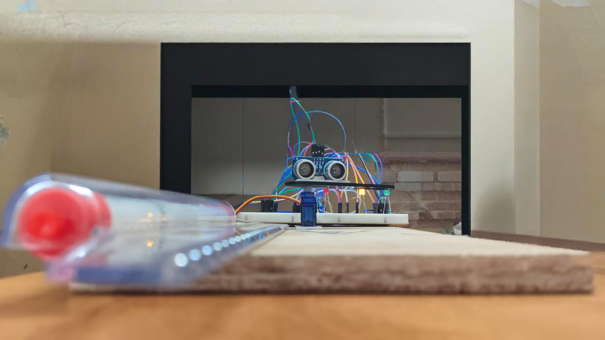
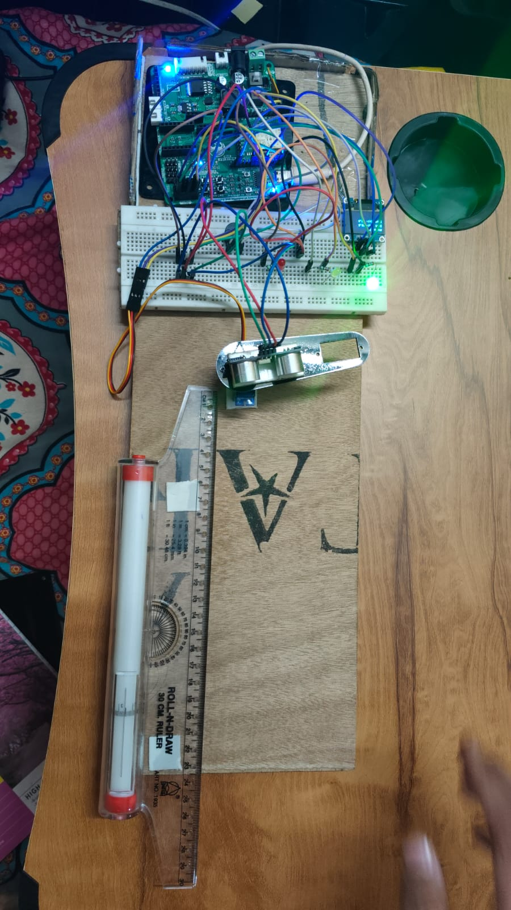
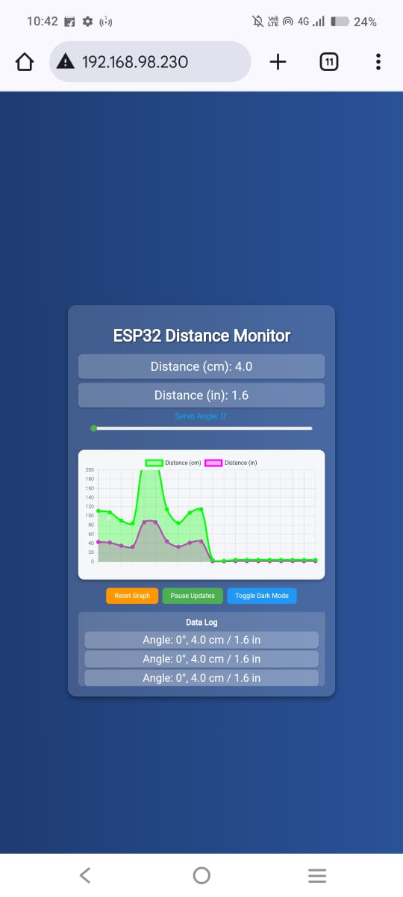

# Smart Distance Monitoring System using ESP32

A real-time distance monitoring system built with ESP32, featuring live updates on a web interface, visual alerts, and a working OLED display.

---

## Features
- Real-time distance measurement using ultrasonic sensor
- Web interface for live monitoring with Chart.js
- Visual alerts via LEDs and buzzer
- Servo movement based on distance thresholds
- OLED display showing instant distance readings

---

## Project Views

**Front View:**  

**Top View:**  

**Web Interface:**  

---

## Demo Video

<video width="600" controls>
  <source src="WORKING-VIDEO.mp4">
</video>

---

## How to Run
1. Open `main.ino` in Arduino IDE.  
2. Connect the ESP32 to your PC via USB.  
3. Upload the code to the ESP32.  
4. Open the Serial Monitor to check the ESP32 IP address.  
5. Access the web interface via the ESP32 IP in your browser.

---

## Hardware Components
- ESP32 Development Board  
- Ultrasonic Distance Sensor (HC-SR04)  
- Servo Motor  
- Buzzer  
- LEDs  
- OLED Display  

---

## Notes
- Ensure all libraries for ESP32, OLED, and servo are installed in Arduino IDE.  
- Video demonstrates real-time working and alerts system.

---

